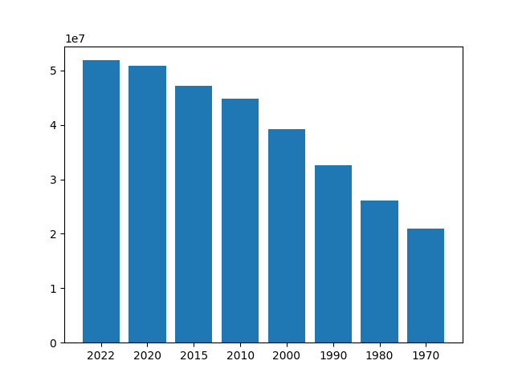

# Proyecto de Visualización de Datos con Python

Este proyecto proporciona herramientas para la visualización de datos utilizando gráficos de barras y gráficos circulares. Está diseñado para trabajar con un conjunto de datos de población mundial.

## Contenido del proyecto

El proyecto contiene los siguientes archivos:

```
/app
---charts.py
---data.csv
---main.py
---read_csv.py
---utils.py
```

- `charts.py`: Este archivo contiene funciones para generar gráficos de barras y gráficos circulares utilizando la biblioteca Matplotlib.
- `data.csv`: Este archivo es un conjunto de datos de población mundial obtenido de [Kaggle](https://www.kaggle.com/datasets/iamsouravbanerjee/world-population-dataset).
- `main.py`: Este archivo es el punto de entrada del proyecto y utiliza las funciones definidas en `utils.py`, `read_csv.py` y `charts.py` para generar un gráfico de barras de la población de un país específico.
- `read_csv.py`: Este archivo contiene una función para leer el archivo CSV de datos y convertirlo en una lista de diccionarios.
- `utils.py`: Este archivo contiene funciones auxiliares para procesar los datos y obtener información sobre la población de un país.

## Configuración del entorno

1. Asegúrate de tener Python 3 instalado en tu sistema.
2. Instala las dependencias ejecutando el siguiente comando:
   ```
   pip install matplotlib
   ```

## Uso del proyecto

Sigue los pasos a continuación para utilizar el proyecto:

1. Descarga el archivo `data.csv` del enlace proporcionado en la sección de contenido del proyecto y colócalo en la carpeta `/app` del proyecto.
2. Abre una terminal y navega hasta la carpeta raíz del proyecto.
3. Ejecuta el siguiente comando:
   ```
   python main.py
   ```
4. Se te pedirá que ingreses el nombre de un país. Escribe el nombre de un país y presiona Enter.
5. Se generará un gráfico de barras que muestra la población del país seleccionado en diferentes años.

## Ejemplo de visualización
### Colombia:



## Contribución

Si deseas contribuir a este proyecto, sigue los pasos a continuación:

1. Realiza un fork de este repositorio.
2. Crea una rama con el nombre de tu nueva característica o solución de error.
3. Realiza los cambios necesarios y realiza commits descriptivos.
4. Envía una solicitud pull para revisar tus cambios.